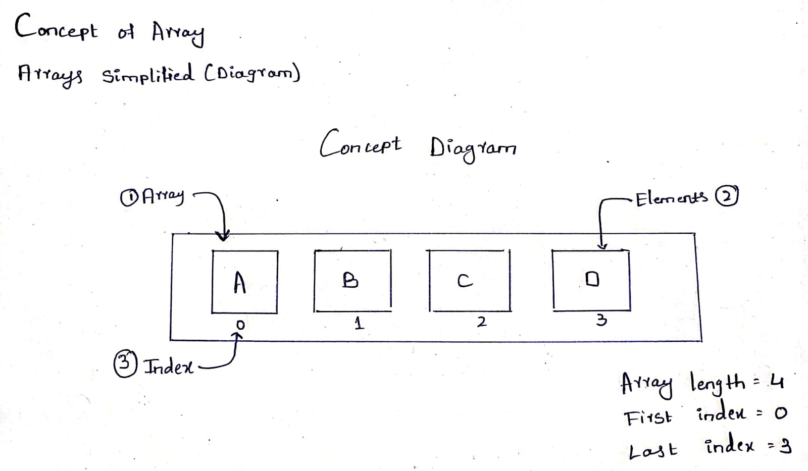

# DSA NOTES

## Introduction to Arrays

Arrays are one of the most commonly used data structures. They store elements of the same data type in contiguous memory locations, which allows efficient access and manipulation.

## Key Concepts in Array Operations

- Element Index/Position:

        The location of an element in the array, usually starting from 0.

- Element Value:

        The actual data/value stored at a particular index.

### Advantages of Arrays

- Store multiple same-type elements using a single variable.
- Fast element access using index (unlike linked lists which require traversal).

### Disadvantages of Arrays

- inserting/removing from the middle is slow due to element shifting.
- In some languages, array size can't change after it's created. To add more items, a new bigger array must be made and old items copied ,which takes time.

### Impact of Time Complexity

- Getting an element using its index is fast: O(1).
- Adding or removing elements in the middle or beginning is slower: O(n).

### Visual Breakdown: What’s inside an array



### Declaration and Initialization of Arrays

Syntax:

```cpp
dataType arrayName[arraySize]={array,items};
```

Example:

```cpp
int numbers[4]={10,20,30,40};
```

### Accessing Elements in an Array

You can access any array item by using its index.

Syntax:

```cpp
arrayName[indexNumber];
```

Example:

```cpp
numbers[2];
```

Output: 30

### How to Access an Array Element (Code)

```cpp
#include <iostream>
using namespace std;

int main()
{
    int numbers[4] = {10, 20, 30, 40};
    int index;

    cout << "Enter the index (0 to 3): ";
    cin >> index;

    cout << "The value at index " << index << " is: " << numbers[index];

    return 0;
}

```

Output:

```cpp
Enter the index (0 to 3): 2
The Value At 2 is: 30

```

### Array Operations

1.  Declaration and Initialization

```cpp
int numbers[]; //Declaration only
int numbers[]={10,20,30,40}; //Declaration+initialization
```

1. 
2. Accessing Elements

```cpp
cout<<numbers[2];//Access value at index 2
```

1.  Updating Elements

```cpp
numbers[1] = 50;  // Updates the value at index 1 to 50
```

1.  Input from User

```cpp
for(int i = 0; i < 5; i++) {
    cin >> numbers[i];  // Taking input into array
}
```

1. Traversal (Printing Elements)

```cpp
for(int i = 0; i < 5; i++) {
    cout <<numbers[i];
}
```

1. Finding the Maximum Element

```cpp
int max=numbers[0] //assuming element at index 0 is maximim

for(int i=1;i<5;i++){//loop through the array
   if(numbers[i]>max) //if current element is greater than current max  
   max=numbers[i];//update max
}
cout<<"max value is:"<<max;
```