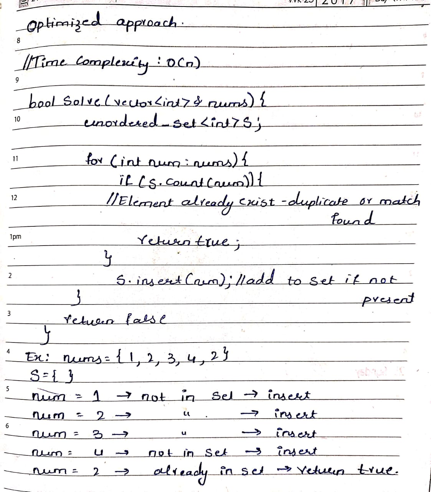
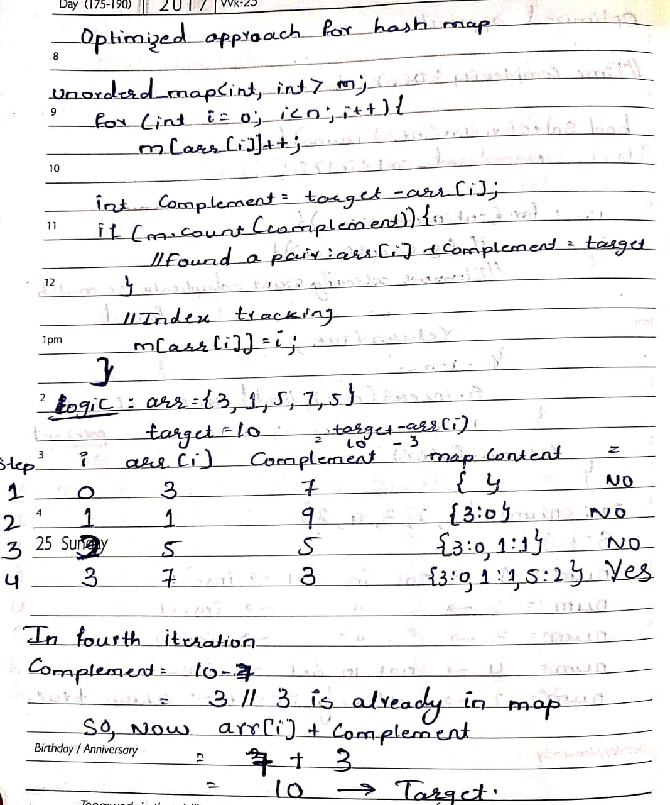

# Hashing

**what is hashing?**

Hashing is a technique used in data structures that efficiently stores and retrieves data in a way that allows for quick access.

- Hashing involves mapping data to a specific index in a hash table (an array of items) using a hash function.
- we can achieve all three operations (search, insert and delete) in O(1) time on average.

## Introduction to Hashing

- Hashing: Converts large input into a small, fixed-size value.
- Uses a hash function to generate an index.
- Index is used to store/retrieve data in a hash table.
- Provides fast access (average time: O(1)).

### Hash Table

A data structure that stores data at specific indices computed using a hash function for fast access.

### Hash Function

A function that takes input data and returns a fixed-size integer (hash code) used as an index in a hash table.

### Hash-Based STL Containers

1. 

1. Difference Between Map and Set

| Feature | Map | Set |
| --- | --- | --- |
| Purpose | Stores key value pairs | Stores unique values only |
| Structure | { key ⇒ value} | { value } |
| Key/Value | Has both key and value | only stores keys (as values) |
| Duplicates | Keys must be unique | values must be unique |
| Access | Access via key (m[key]) | Use .find() to search |
| Order | Sorted by key | Sorted by Value |
| Time Complexity | O(log n) | O(log n) |
1. unordered_set

unordered_set is a C++ STL container that stores unique elements in no particular order, and provides average constant time complexity (O(1)) for insertion, deletion, using hashing.

Example: for unorderd_set

```cpp
#include<iostream>
#include<unordered_set>
using namespace std;

int main(){
// Step 1: Create an unordered_set of integers
unordered_set<int> a;

//step 2: inserting elememts
a.insert(5);
a.insert(3);
a.insert(5);//duplicates will be ignored automaticlly.
a.insert(2);

//step 3: print the elements
cout<<"set elements";
for (int x : a){
      cout<<x<<" ";
}
cout << endl;
//order is not same 

//step 4:check if the element is present using count()
int x=5;
if(a.count(x)){
       cout<<x<<"is present in the set"<<endl;
}else{
       cout<<x<<"is not present in the set"<<endl;
}

//step 5: remove an element using erase()
a.erase(3);//removes 3 from the set

// Step 6: Use find() to get an iterator to an element

auto it = a.find(30); // Returns iterator to 30 if found, else s.end()
    if (it != a.end()) {
        cout << "Found element: " << *it << endl;
    } else {
        cout << "Element not found" << endl;
    }
//iterator is a tool that points to a specific elment in a conatiner so you can access or modify it.
// Step 7: Try to find a removed element
    if (a.find(3) == a.end()) {
        cout << "3 is no longer in the set" << endl;
    }
// Step 8: Final set state
    cout << "Final set: ";
    for (int val : a) {
        cout << val << " ";
    }
    cout << endl;

    return 0;
}
```

1. unorderd_map

```cpp
#include <iostream>
#include <unordered_map>
using namespace std;

int main() {
    // Step 1: Create an unordered_map
    unordered_map<int, string> m; // Key: int, Value: string

    // Step 2: Insert elements into the map
    m[1] = "Apple";
    m[2] = "Banana";
    m[3] = "Cherry";
    m[2] = "Blueberry";  // Overwrites "Banana" with "Blueberry"

    // Step 3: Print all key-value pairs
    cout << "Map contents:" << endl;
    for (auto pair : m) {
        cout << "Key: " << pair.first << ", Value: " << pair.second << endl;
    }
    // Note: Order is not guaranteed (unordered_map)

    // Step 4: Access value by key
    cout << "Value at key 1: " << m[1] << endl;

    // Step 5: Check if a key exists using count()
    int key = 4;
    if (m.count(key)) {
        cout << "Key " << key << " is present with value: " << m[key] << endl;
    } else {
        cout << "Key " << key << " is NOT present in the map" << endl;
    }

    // Step 6: Insert using insert() method
    m.insert({4, "Dates"});  // Insert key=4 with value="Dates"

    // Step 7: Remove a key using erase()
    m.erase(3); // Removes the key 3 (Cherry)

    // Step 8: Use find() to get an iterator to a key
    auto it = m.find(2); // Try to find key=2
    if (it != m.end()) {
        cout << "Found key 2 with value: " << it->second << endl;
    } else {
        cout << "Key 2 not found." << endl;
    }

    // Step 9: Try to find a removed key
    if (m.find(3) == m.end()) {
        cout << "Key 3 is no longer in the map" << endl;
    }

    // Step 10: Final state of the map
    cout << "Final map state:" << endl;
    for (auto p : m) {
        cout << "Key: " << p.first << ", Value: " << p.second << endl;
    }

    return 0;
}
```

1. Hash set


This is the Brute force approach where we are using two for loops so time complexity becomes O(n^2). 

### optimized approach



here we are using only one for loop so time complexity becomes O(n).

### Brute force for hash map problems

```cpp
// time complexity: O(n^2)

bool solve(vector<int>& nums) {
    int n = nums.size();

    for (int i = 0; i < n; i++) {
        int count = 0;

        // Count how many times nums[i] appears in the entire array
        for (int j = 0; j < n; j++) {
            if (nums[j] == nums[i]) {
                count++;
            }
        }

        // Example use: check for duplicates
        if (count > 1) {
            return true;
        }
    }

    return false;
}
```

### Optimized approach for hash map

